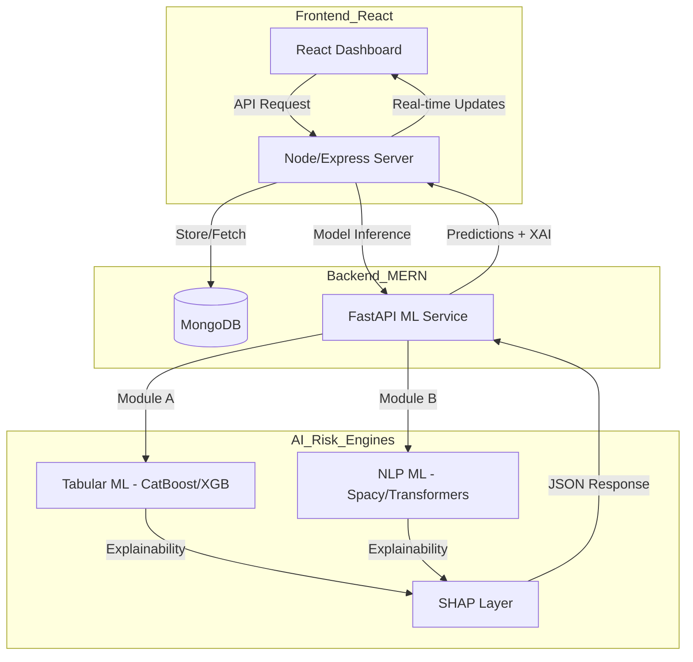

# Student & Mental Health Risk Prediction with Explainable AI

## 📌 Project Overview

This project is a dual-module AI decision system designed to identify academic risks and mental health stress in students. It combines structured tabular data analysis with natural language processing to provide a holistic view of student well-being, backed by explainable AI (XAI) to ensure transparency in decision support.

The application is built on the **MERN Stack** (MongoDB, Express.js, React, Node.js) with a **Python/FastAPI** microservice serving the ML models.

---

## 🚦 Project Status: Phase 1 — Problem Framing

We are currently defining the scope, target metrics, and ethical boundaries of the system.
See [Problem Framing Report](docs/report/01_problem_framing.md) for details.

---

## 👥 User Impact

- **Educational Institutions**: Reduce dropout rates through early academic intervention.
- **Mental Health Support**: Identify "silent" stress signals that traditional surveys miss.
- **Student Agency**: Provide students with transparent reasons for their risk assessments.

---

## 🔄 MERN + ML Pipeline Flow



---

## 🚀 Core Modules

### Module A: Student Academic Risk Prediction (Tabular ML)

- **Goal**: Predict the probability of academic failure or dropout.
- **Features**: Attendance records, previous grades, study hours, and lifestyle indicators.
- **Output**: Risk score (0.1 - 1.0) and primary risk factors.

### Module B: Mental Health Text Risk Detection (NLP ML)

- **Goal**: Analyze student-generated text (journals, logs) to estimate mental stress levels.
- **Inputs**: Sentiment analysis and stress-related keywords.
- **Output**: Emotional risk level (Low, Medium, High) and semantic themes.

---

## 🛠 Project Architecture

```text
student-risk-ai/
├── data/                      # Raw and processed datasets
├── notebooks/                # Experimental and exploratory analysis
├── src/                      # ML Pipeline Code
│   ├── preprocessing.py      # Data cleaning
│   ├── feature_engineering.py # Vectorization & Encoding
│   ├── training.py           # Model persistence
│   ├── explainability.py      # SHAP integration
│   ├── student_pipeline.py    # Module A orchestration
│   └── text_pipeline.py       # Module B orchestration
├── models/                   # Saved ML artifacts (.pkl)
├── app/                      # MERN Fullstack Layer
│   ├── client/               # React Frontend
│   │   ├── src/
│   │   └── package.json
│   ├── server/               # Express/Node Backend
│   │   ├── models/           # Mongoose Schemas
│   │   ├── routes/           # API Endpoints
│   │   └── server.js
│   └── ml_service/           # FastAPI bridge for ML
│       └── main.py
├── docs/                     # Reports & Ethics
├── requirements.txt          # Python dependencies
└── README.md
```

---

## ⚖️ Ethics & Bias Safeguards

- **Non-Diagnostic Disclaimer**: Module B is a detection tool, not a clinical diagnostic system.
- **Bias Mitigation**: Continuous monitoring for demographic bias (gender, socio-economic status).
- **Impact Assessment**: Prioritizing sensitivity in mental health detection while maintaining precision in academic risk.

---

## 🔍 Explainability Strategy

- **Global Explanations**: Overall feature importance for institutions.
- **Local Explanations**: SHAP-based "Why this student?" reasoning for individual scores.
- **Actionable Insights**: Converting raw weights into human-readable intervention suggestions.

---

## 📝 Future Work

- Integration with real-time Student Information Systems (SIS).
- Advanced transformer-based NLP (BERT/RoBERTa).
- Automated intervention scheduling via dashboard notifications.
